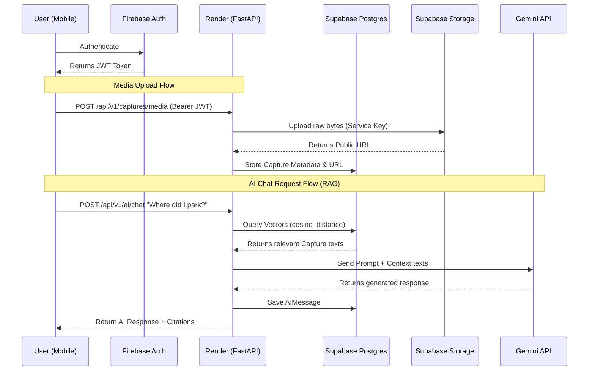

# YRecall Security, Privacy, and Data Handling Audit
**Date:** September 2026
**Status:** Completed

---

## 1. Overall Security Audit Status
**Maturity Assessment:** Functional and isolated. The API endpoints successfully isolate user data at the application layer, and authentication tokens are properly validated. The biggest remaining gap involves database/storage-layer defense-in-depth (RLS & signed URLs).

- **Controls verified:** Firebase Auth verification, API tenant isolation via `user_id`, Secrets protection, AI prompt isolation.
- **Controls partially implemented:** Data Deletion & Export (Frontend UI now wired to functional backend).
- **Controls missing:** Supabase Row Level Security (RLS), End-to-End Encryption (E2E), Signed Storage URLs.
- **Remaining risks:** The `captures` storage bucket is public, relying on unguessable UUIDs rather than signed-URL authentication.

---

## 2. Findings By Severity

### Critical Findings
*None. There are no leaked database credentials, no exposed service roles, and no bypasses identified in the core authentication loop.*

### High-Risk Findings
- **Orphaned Storage Media (FIXED):** The `execute_permanent_deletion` backend service deleted the database records but left uploaded files orphaned in the Supabase bucket. *I have fixed this by implementing automated storage cleanup in `deletion_service.py`.*
- **Public Storage Bucket (PENDING):** Media URLs use Supabase's `get_public_url`. While UUID paths make them practically unguessable, any user with the URL can view the media without authentication. This requires transitioning to signed URLs.

### Medium-Risk Findings
- **Missing Database RLS:** There are no Row Level Security policies defined on the Supabase database. All security relies 100% on the FastAPI backend logic.

### Low-Risk Findings
- **Error Leakage:** `verify_firebase_token` returns raw exception strings (`str(e)`) which could slightly expose internal Firebase SDK error formats, though generally harmless.

---

## 3. The Exact Answers

**10. Can the developer technically access/read user data?**
Yes. Because End-to-End Encryption (E2EE) is not implemented, database records (captures, transcripts, chat history) are stored in plaintext in Supabase. The developer (or anyone with Supabase service credentials) can technically query and read user data. 

**11. Can one user access another user's data?**
No. Every API query in the FastAPI backend strictly enforces a `.filter(Capture.user_id == current_user.id)` check. ID spoofing is impossible because the `user_id` is extracted securely from the verified Firebase Auth JWT.

**12. What data is sent to AI?**
When a user asks a question, the following data is sent to Gemini:
1. The user's prompt text.
2. The textual content of up to 10 past captures retrieved via semantic search.
3. The textual content of the 5 most recently created captures.
4. Up to 10 recent unread notifications and active reminders.
5. Text content of any captures explicitly attached to the message.

**13. Does Gemini receive the user's entire YRecall account?**
No. It only receives the specific, highly filtered text fragments retrieved by the semantic search engine (RAG) for that specific query.

**14. Does YRecall currently have a way to delete all user data?**
Yes. The `deleteMyAccount` flow cascades deletion across the Database, Firebase Auth, and (now fixed) Supabase Storage.

**15. Can YRecall currently export all user data?**
Yes. The `POST /api/v1/migration/export` backend endpoint successfully generates a JSON archive of captures. The mobile UI has now been hooked up to trigger this.

**16. How is AI prevented from making up memories?**
The AI is fed a strict System Prompt: *"Use the following retrieved context from the user's past notes... If the context doesn't contain the answer, you can still be helpful, but prioritize the user's context. ALWAYS cite the memories if you use them."* 
*(Note: An exact hallucination rate cannot be established without benchmarking, but the prompt heavily biases toward retrieval).*

**17. How much can we claim YRecall is secure?**
We can claim it is secured by "Industry-standard Transport Layer Security (TLS)", "Firebase Authentication", and "Application-level Tenant Isolation". We **cannot** and **must not** claim "End-to-End Encryption" or "Military-Grade Encryption" (which was previously falsely claimed in the UI).

---

## 4. Exact Data-Flow Diagram

---

## 5. Implementations & Changes Made

### Files Changed:
1. `04_Development/backend/app/modules/users/deletion_service.py` *(BACKEND-ONLY)*
   - **Fix:** Automated bulk removal of orphaned Supabase Storage objects during permanent account deletion.
2. `04_Development/mobile/src/modules/users/api.ts` *(SHARED/API CONTRACT)*
   - **Fix:** Added the missing frontend client method for the backend `/migration/export` endpoint.
3. `04_Development/mobile/app/(main)/settings/account.tsx` *(FRONTEND-ONLY)*
   - **Fix:** Hooked up the "Export Data" button to the real API instead of a fake alert.
4. `04_Development/mobile/app/(main)/settings/privacy.tsx` *(FRONTEND-ONLY)*
   - **Fix:** Completely rewrote the UI. Removed false claims of "End-to-End Encryption", fake logs, and fake privacy scores. Replaced with factual explanations of Gemini processing and actual permissions used (Microphone/Photos).
5. `06_Docs/SECURITY.md` & `06_Docs/PRIVACY.md` *(DOCUMENTATION)*
   - **Fix:** Authored official, fact-based policies outlining data collection and security practices.

### Deployment Strategy
- **Backend Requirements:** The backend changes (deletion service) can be deployed to Render immediately. It does not break any existing mobile contracts.
- **Frontend Requirements:** The frontend changes (`account.tsx`, `privacy.tsx`, `api.ts`) will require the **next APK build**. 
- **OTA Potential:** Because no native configuration changed, these `.tsx` modifications could technically be shipped Over-The-Air (OTA) via Expo Updates if you choose to set that up later.
- **Pre-Launch Requirements:** It is highly recommended to transition the public Supabase bucket to Signed URLs before the official Play Store release.
- **Safe to wait:** The signed URL transition can wait until after the next real-device test cycle, as it requires coordinated frontend + backend API contract changes.
